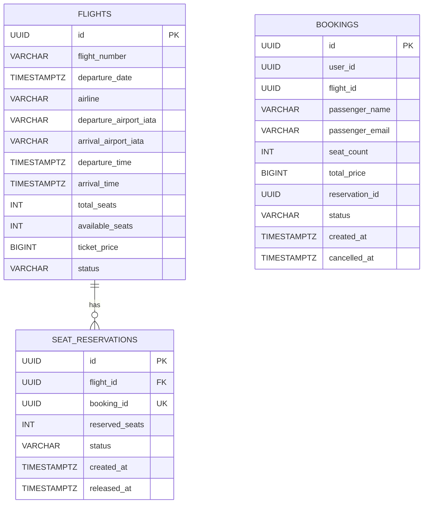

# ER Diagram

## 3NF notes

- `Flight` stores only attributes of one concrete flight.
- `SeatReservation` stores only attributes of one reservation and references exactly one flight.
- `Booking` stores only attributes of one booking in Booking Service.
- Redundant columns like passenger first/last name split and flight snapshot fields are removed from `Booking`, so non-key attributes depend only on the booking key.

## Integrity constraints

- `flights.total_seats > 0`
- `flights.available_seats >= 0`
- `flights.available_seats <= flights.total_seats`
- `flights.ticket_price > 0`
- `flights.arrival_time > flights.departure_time`
- `flights.departure_airport_iata <> flights.arrival_airport_iata`
- unique flight: `UNIQUE(flight_number, departure_date)`
- `seat_reservations.reserved_seats > 0`
- one booking -> one reservation: `UNIQUE(booking_id)`
- `bookings.seat_count > 0`
- `bookings.total_price > 0`

